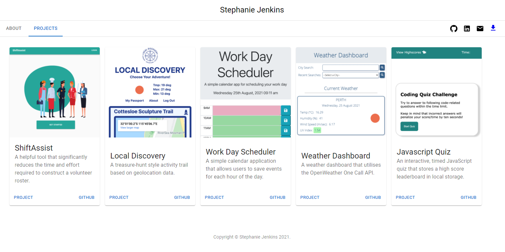

# react-portfolio

## Table of Contents

-   [About](#about)
-   [Links](#links)
-   [Credits And Thanks](#credits-and-thanks)
-   [Questions](#questions)
-   [Screenshots of Deployed Application](#screenshots-of-deployed-application)

## About

Basic developer portfolio created with React and Material-UI. Deployed via GitHub Pages

## Links

[Deployed Portfolio](https://stephje.github.io/react-portfolio/)

[Github Repository](https://github.com/stephje/react-portfolio)

## Credits and Thanks

Utilises some example code and templates from the [Material-UI website](https://mui.com/)

## Questions

For any questions pertaining to this project, the developer can be reached via any of the contact methods listed below.
Please ensure that you include the name of this project ("React Portfolio") or repository ("react-portfolio") in any communications.

-   [GitHub](https://github.com/stephje)
-   [Email](mailto:s.jenkins3018@gmail.com)

## Screenshots of Deployed Application

### Sign In Page

